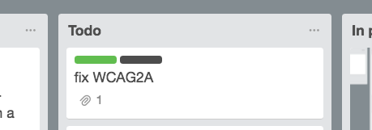

# A Set of CSS Styles for Improving Trello

## Overview
* adds label name to labels so you can tell what the label is at a glance
* adds custom label colors so you can expand beyond the default 10

### Labels - Before
* labels show up as simple color bars

### Labels - After
* labels now have custom colors and helpful descriptions

## Dependencies
These adjustments use CSS styles so you'll need a browser plugin to run them. I've created these specifically for [Stylebot](https://chrome.google.com/webstore/detail/stylebot/oiaejidbmkiecgbjeifoejpgmdaleoha), a Google Chrome Extension, but you can copy the CSS into your favorite CSS browser tool.

## Chrome Installation Instructions
* Install [Stylebot](https://chrome.google.com/webstore/detail/stylebot/oiaejidbmkiecgbjeifoejpgmdaleoha)
* Go to Stylebot options
* Select Styles
* Select Add a new style
* Make "trello.com" the url
* Paste in this CSS

## Safari Installation Instructions

1. Download <http://sobolev.us/stylish/>
2. Select the Stylish icon in toolbar
3. Select `Manage` button
4. Choose `Edit` to make a new style
5. Paste [trello-mod.css](/trello-mod.css) in the Css field
6. Set Domain to `trello.com`
7. Save
8. Enjoy!
